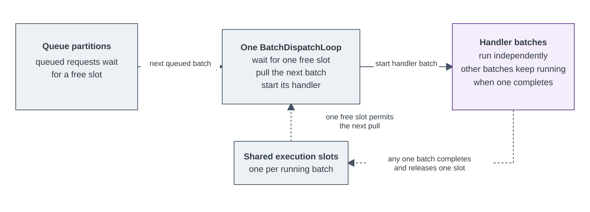

# RequestBatcher

[](https://www.nuget.org/packages/RequestBatcher)
[](https://github.com/eventhorizon-cli/RequestBatcher/actions/workflows/dotnet-build.yml)
[](https://codecov.io/gh/eventhorizon-cli/RequestBatcher)
[](LICENSE)

**English** | [简体中文](README.zh-CN.md)

RequestBatcher lets application code submit one request and await one `Task`, while an application handler receives
multiple queued requests at a time. It is an in-process way to use a downstream batch operation without exposing batch
coordination to every caller.

> **Batching does not require callers to assemble a collection.** Separate callers can each submit one `TRequest`
> concurrently. RequestBatcher coalesces requests already queued for the same partition into handler batches of up to
> `BatchSize`. `ProcessAsync(IEnumerable<TRequest>)` is an additional submission option, not a prerequisite for
> batching.


Separate concurrent requests can be combined into one batch before a downstream batch operation. The illustration is
an example: only requests already queued in the same partition can be combined into one handler batch.

## When to Use It

Use RequestBatcher when requests are independent, temporary in-memory queuing is acceptable, and the downstream
operation benefits from receiving multiple items:

- database writes that can use batch `INSERT`, `UPDATE`, or `UPSERT`;
- cache reads or writes and downstream APIs that already accept multiple items;
- short traffic bursts where internal queue capacity and downstream concurrency must be bounded;
- work where caller cancellation should discard only requests that have not been dispatched, while dispatched work
  must be allowed to finish independently of that caller;
- related requests that benefit from batch-level merging without relying on handler ordering.

For database updates, if partial success within one handler invocation would leave inconsistent state, the handler
should execute that invocation in one transaction. RequestBatcher propagates the handler outcome but cannot roll back
writes that have already been committed.

## When Not to Use It

RequestBatcher is not a durable background queue or a transaction coordinator:

- Accepted work must survive process failure. Use durable storage or a reliable message broker.
- The operation must commit or roll back with the caller's transaction. Keep it in that transaction.
- Every call needs a direct `TResult`. RequestBatcher returns completion through `Task`; a batched query must carry its
  own result holder or update application state.
- The downstream operation requires automatic retries or exactly-once effects. RequestBatcher provides neither.
- The handler requires a minimum batch size or a fixed collection window. RequestBatcher dispatches currently queued
  work without waiting to fill a batch.
- An in-flight downstream operation must stop as soon as its individual caller disconnects, times out, or cancels.
  One handler batch can contain requests from several callers, so caller cancellation tokens are not forwarded to the
  handler and cannot cancel the shared handler call.

## How It Works

1. A caller submits one request through `ProcessAsync`.
2. RequestBatcher admits the request according to the configured capacity and routes it to an in-memory partition.
3. The internal `BatchDispatchLoop` acquires a free handler slot, then pulls and auto-commits up to `BatchSize`
   requests that are already queued.
4. The handler outcome completes the `Task` returned to every caller represented in that handler batch.

`BatchSize` is an upper bound, not a minimum. RequestBatcher does not hold the first request for a fixed batching
window, so low traffic may produce single-request batches while concurrent traffic naturally produces larger batches.


The architecture diagram shows the coordinator, the in-memory partition queue, and the separate `Task` completion
path for each accepted request.

### Internal Dispatch Scheduling



`MaxConcurrency` bounds concurrent handler batches. The queue uses
`min(MaxConcurrency, max(1, Environment.ProcessorCount))` internal partitions, while one `BatchDispatchLoop` owns all
of them and shares one global execution-slot pool. A slot is acquired before a queue batch is pulled, so work waits in
BufferQueue rather than in an application-owned handoff queue.

The two sides of the API have different responsibilities:

| Side | API | Meaning |
| --- | --- | --- |
| Caller | `ProcessAsync(TRequest)` | Submits one request and returns a `Task` for that request's actual outcome. |
| Caller | `ProcessAsync(IEnumerable<TRequest>)` | Submits an existing group and returns one `Task` that waits for the whole submission. |
| Handler | `HandleAsync(IReadOnlyList<TRequest>)` | Processes one batch selected by RequestBatcher and returns a `ValueTask` as its completion signal. |

The handler's `ValueTask` is awaited once inside RequestBatcher and is never returned to the caller. It allows a
handler that completes synchronously to avoid allocating a `Task`; regular asynchronous I/O can still be implemented
with `async ValueTask`.

## Installation

```bash
dotnet add package RequestBatcher
```

## Quick Start

Define the request and the code that handles one batch:

```csharp
public sealed record OrderWriteRequest(long OrderId, decimal Amount);

public interface IOrderStore
{
    Task WriteBatchAsync(
        IReadOnlyList<OrderWriteRequest> requests,
        CancellationToken cancellationToken);
}

public sealed class OrderWriteBatchHandler(IOrderStore store)
    : IRequestBatchHandler<OrderWriteRequest>
{
    public async ValueTask HandleAsync(
        IReadOnlyList<OrderWriteRequest> requests,
        CancellationToken cancellationToken = default)
    {
        await store.WriteBatchAsync(requests, cancellationToken);
    }
}
```

Register the handler and RequestBatcher together. The handler lifetime is part of the registration; the minimal setup
only needs a batch size:

```csharp
services.AddRequestBatcher<OrderWriteRequest, OrderWriteBatchHandler>(
    ServiceLifetime.Scoped,
    options =>
    {
        options.BatchSize = 256;
    });
```

Inject `IRequestBatcher<TRequest>` into the normal application call path:

```csharp
public sealed class OrderService(IRequestBatcher<OrderWriteRequest> batcher)
{
    public Task SaveAsync(
        OrderWriteRequest request,
        CancellationToken cancellationToken = default) =>
        batcher.ProcessAsync(request, cancellationToken);
}
```

`SaveAsync` returns the same `Task` produced by RequestBatcher. It completes only after the handler has processed the
request; the caller does not need to know which batch or partition contained it. A handler delegate can also be
registered when a separate handler class is unnecessary.

### Submitting an Existing Group

When the caller already has multiple requests, it can submit them with one call:

```csharp
await batcher.ProcessAsync(orderWriteRequests, cancellationToken);
```

RequestBatcher snapshots the sequence and submits it as one producer operation. In `Wait` mode, a group no larger than
`MaxPendingRequests` is admitted atomically; a larger group is admitted as consecutive capacity-sized slices as
capacity becomes available. In `Fail` mode, the whole group must fit immediately. The returned `Task` waits for every
request from the submission. This does not force the sequence into one handler call: it may still be split by
`BatchSize` or partition routing.

> **An explicit group is not a partition boundary.** With more than one partition, RequestBatcher routes every item
> independently; it does not send the whole submission to one partition. The group is guaranteed to stay in one
> partition only when `MaxConcurrency = 1`, or when every item produces the same partition key.

## Single and Group Submission

In this documentation, a **submission** is one caller invocation of `ProcessAsync`. A **handler batch** is the
`IReadOnlyList<TRequest>` passed to one `HandleAsync` invocation. They are not the same boundary.

| Behavior | Single request | Explicit group |
| --- | --- | --- |
| Input | Uses the supplied `TRequest`. | Enumerates once and snapshots the sequence. An empty sequence completes immediately. |
| Capacity | Reserves capacity for one request. | `Wait` admits an oversized group in consecutive capacity-sized slices; `Fail` requires the whole group to fit immediately. |
| Routing | Routes the request using the configured routing mode. | Routes every item independently, so one submission can span several partitions. |
| Handler calls | May be handled together with other requests already queued in the same partition. | Does not create a handler boundary. Items can be split by partition and `BatchSize`, and may run in parallel. |
| Completion | The returned `Task` represents this request's actual handler outcome. | The returned `Task` waits for every item in the submission. |
| Failure | A handler failure fails every request in that handler batch. | Some items may succeed before another handler batch fails. The group `Task` faults, but successful work is not rolled back. |
| Cancellation | Cancellation removes the request only before dispatch. | The same token applies to every item; undispatched items can be canceled while dispatched items continue to their actual outcome. |

## Routing and Dispatch

`MaxConcurrency` is the global maximum number of concurrent handler batches. The number of internal queue partitions
is `min(MaxConcurrency, max(1, Environment.ProcessorCount))`, and one `BatchDispatchLoop` pulls from all of them.

| Configuration | Request routing | Dispatch behavior |
| --- | --- | --- |
| `MaxConcurrency = 1` | Every request uses one queue partition. | One handler batch can execute at a time. |
| `MaxConcurrency > 1`, no partition key | Round-robin advances once per request across the capped partition count. | Batches from any partition compete for the same global execution slots. |
| `MaxConcurrency > 1`, with `UsePartitionKey` | The selector is applied to every request; equal keys route to one queue partition. | Equal keys can still be dispatched in separate handler batches at the same time. |

RequestBatcher provides no global, partition-local, or partition-key ordering guarantee. A partition key controls only
queue routing; it is not a serialization mechanism.

## Processing Semantics

### Completion and Failure

- A successful handler call completes every caller represented in that handler batch.
- If the handler throws, those callers receive the original exception.
- RequestBatcher does not retry a failed handler.
- The batch overload waits for the whole submitted group and faults if any handler call involved in that submission
  fails.
- If several handler calls fail for one explicit group, `await` throws one original exception following normal `Task`
  semantics. All distinct exception instances remain available through `Task.Exception.InnerExceptions`; one handler
  exception fanned out to several requests is recorded once.

### Caller Cancellation

Caller cancellation can remove a request only before handler dispatch. Once the handler starts, RequestBatcher reports
the real handler outcome instead of changing the caller's `Task` to canceled. This prevents cancellation from hiding a
side effect that may already have happened.

The token passed to the handler belongs to RequestBatcher's processing lifetime, not to an individual caller. One
caller's cancellation therefore cannot cancel work for the other requests in the same batch.

For an explicit group, the caller token is applied to every item. Cancellation can therefore leave a mix of canceled
items and items that were already dispatched. The returned `Task` still waits for all items; it faults if any item
faults, otherwise it is canceled when at least one item was canceled. Completed side effects are not rolled back.

### Capacity and Backpressure

`MaxPendingRequests` sets the bounded BufferQueue capacity for requests that remain queued. A batch is auto-committed
when the dispatch loop pulls it, before its handler starts. Therefore, up to `MaxConcurrency * BatchSize` pulled
requests can be executing in addition to queued capacity. It is not a limit on the size of an explicit submission or
on the number of callers waiting for capacity:

- `FullMode = Wait` waits asynchronously for enough capacity and honors caller cancellation while waiting.
- In `Wait` mode, a group no larger than the capacity is admitted atomically. A larger group is split into consecutive
  capacity-sized slices. Cancellation can leave already dispatched requests running while undispatched requests are
  canceled.
- `FullMode = Fail` requires the whole submission to fit immediately. Otherwise, including when a group is larger than
  the capacity, it returns a faulted `Task` with `RequestBatchQueueFullException` without admitting any item.

### Shutdown

`StopAsync` and `DisposeAsync` stop accepting new requests and drain every submission that started before shutdown,
including submissions waiting for capacity. Canceling the token passed to `StopAsync` stops only that wait; shutdown
continues in the background.

## Configuration

| Option | Default | Behavior |
| --- | ---: | --- |
| `BatchSize` | `128` | Maximum requests passed to one handler call. |
| `MaxConcurrency` | `1` | Maximum concurrent handler batches; queue partitions are capped at the logical processor count. |
| `MaxPendingRequests` | `8192` | Internal BufferQueue capacity for requests that have not yet been pulled for execution. |
| `FullMode` | `Wait` | Waits for capacity; `Fail` rejects immediately when capacity is unavailable. |
| `UsePartitionKey(...)` | Not set | Uses round-robin routing by default; equal selected keys are routed to one queue partition. |

No ordering is guaranteed for handler execution, including when `MaxConcurrency = 1`.

## Partition Keys

A partition key is an optional routing rule for related requests:

```csharp
options.MaxConcurrency = 4;
options.UsePartitionKey(request => request.OrderId);
```

Equal finite, integer-valued numeric keys or equal non-null string keys are routed to the same queue partition.
Different keys can still share a partition, so keys and partitions are not one-to-one.

Partition routing does not force all requests for one key into the same handler batch, and it does not deduplicate
requests. It does not provide an execution-order or mutual-exclusion boundary.

### Example: Merge Repeated Updates

Suppose several `PriceUpdate` requests have the same `ProductId`. A handler can group its current batch by product and
write only the highest version. Routing by `ProductId` improves locality, but separate handler calls can still process
that product concurrently.

The storage layer must still prevent stale versions from overwriting newer state across batches because a partition key
does not place every update for one product into the same batch. The runnable
[PostgreSQL Web API sample](samples/RequestBatcher.Deduplication) demonstrates both safeguards:

- the write handler merges repeated product updates within one batch, then performs one bulk upsert;
- the upsert condition ignores older versions that arrive in later batches;
- the query handler deduplicates product IDs before issuing one SQL query for the batch.

## Dependency Injection and Logging

`AddRequestBatcher` registers the handler, coordinator, and internal BufferQueue topic in the application's existing
`IServiceCollection`. The application does not configure BufferQueue directly, and RequestBatcher never builds a
nested service provider.

Scoped and transient handlers are resolved once per handler batch in an asynchronous scope. A singleton handler is
reused across batches and must be thread-safe when `MaxConcurrency > 1`.

Logs use the application's `Microsoft.Extensions.Logging` pipeline under the category
`RequestBatchCoordinator<TRequest>`. Handler failures are logged with their original exception, and request payloads
are not logged.

## Sample

- [PostgreSQL Web API sample](samples/RequestBatcher.Deduplication)

## License

RequestBatcher is available under the [MIT License](LICENSE).
