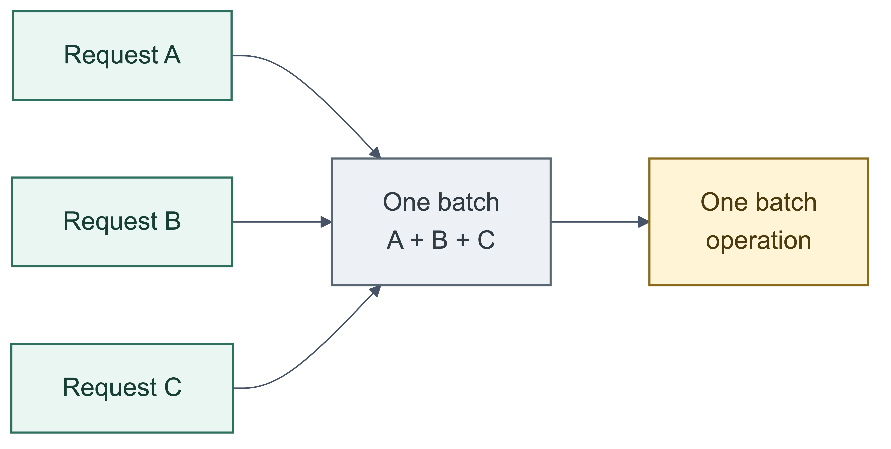

# RequestBatcher

[](https://www.nuget.org/packages/RequestBatcher)
[](https://github.com/eventhorizon-cli/RequestBatcher/actions/workflows/dotnet-build.yml)
[](https://codecov.io/gh/eventhorizon-cli/RequestBatcher)
[](LICENSE)

[English](README.md) | **简体中文**

RequestBatcher 会在 .NET 进程内汇集来自不同调用方的并发请求，将其中已排队的请求合并为批次，交由 Handler
统一处理。调用方仍可逐项提交并等待各自的 `Task`，无需关心请求最终进入哪个批次。

> **调用方无需先将请求收集成一个集合，仍然可以获得批量处理。** 多个调用方可以并发地各自提交一个
> `TRequest`；RequestBatcher 会将同一分区中已排队的零散请求合并为最多 `BatchSize` 项的处理批次。
> `ProcessAsync(IEnumerable<TRequest>)` 只是额外的提交方式，并不是产生批量处理的前提。



多个独立的并发请求可以先合并为一个批次，再执行一次下游批量操作。图中只是示例：只有已在同一分区排队的请求
才可能合并为同一批。

## 适用场景

当请求彼此独立、可以接受在内存中短暂排队（不会等待凑满 `BatchSize`，只需等待所在分区正在执行的 Handler
调用完成），且下游一次处理多项更合适时，可以使用 RequestBatcher：

- 能够使用批量 `INSERT`、`UPDATE` 或 `UPSERT` 的数据库写入；
- 原生支持多项输入的缓存读写或下游 API；
- 需要限制内部队列容量和下游并发量的短时流量突发；
- 调用方取消时，只需要撤销尚未分发的请求；已分发的操作应继续执行并返回实际处理结果；
- 需要保持分区内处理顺序，或可以在同一处理批次内合并相关请求。

数据库更新还需要注意事务边界：如果一次 Handler 调用只成功一部分会造成数据不一致，应由 Handler 在同一个事务中
完成整批更新。RequestBatcher 只负责传递 Handler 的处理结果，不会回滚已经提交的数据。

## 不适用场景

RequestBatcher 既不是持久化后台队列，也不是事务协调器：

- 已接收的请求必须在进程故障后仍可恢复。此时应使用持久化存储或可靠消息队列。
- 操作必须随调用方事务一起提交或回滚。应将它留在原事务中。
- 每次调用都必须直接得到 `TResult`。RequestBatcher 只通过 `Task` 返回完成状态；批量查询需要让请求携带
  自己的结果容器，或更新应用状态。
- 下游操作必须依赖自动重试，或副作用必须严格恰好一次（exactly-once）。RequestBatcher 不提供这些保证。
- 下游操作必须等待最小批量凑齐，或者依赖固定的收集窗口。RequestBatcher 会直接处理当前已排队的请求。
- 单个调用方断开、超时或取消后，正在执行的下游操作也必须立即停止。一个处理批次可能包含来自多个调用方的
  请求，因此单个调用方的 `CancellationToken` 不会传给 Handler，也不能取消这个共享的 Handler 调用。

## 工作方式

1. 调用方通过 `ProcessAsync` 提交单个请求。
2. RequestBatcher 根据容量配置接收请求，并将它路由到一个内存分区。
3. 某个分区可处理时，RequestBatcher 从其中已排队的请求中取出最多 `BatchSize` 个，并调用 Handler 一次。
4. 处理结果会完成该批次中每个调用方持有的 `Task`。

已接收请求在分区中的排队时长主要取决于前一批 Handler 调用何时完成，而不是等待凑满 `BatchSize`。RequestBatcher
不会为凑满单个批次设置额外的收集窗口：前一批完成后，它会立即用当前已排队的请求发起下一次 Handler 调用，即使
只有一个请求。`BatchSize` 只限制单次调用的最大请求数；不同分区仍可并行处理。


架构图展示协调器、分区内存队列，以及每个已接收请求独立完成 `Task` 的详细路径。

调用方和 Handler 的 API 职责不同：

| 使用方 | API | 含义 |
| --- | --- | --- |
| 调用方 | `ProcessAsync(TRequest)` | 提交一个请求，返回反映该请求实际处理结果的 `Task`。 |
| 调用方 | `ProcessAsync(IEnumerable<TRequest>)` | 提交调用方已持有的一组请求，返回等待整次提交完成的 `Task`。 |
| Handler | `HandleAsync(IReadOnlyList<TRequest>)` | 处理 RequestBatcher 选出的一个批次，并用 `ValueTask` 表示完成。 |

RequestBatcher 只会在内部等待 Handler 返回的 `ValueTask` 一次，不会将它返回给调用方。同步完成的 Handler 可以
因此避免分配 `Task`；普通异步 I/O 仍可直接使用 `async ValueTask` 实现。

## 安装

```bash
dotnet add package RequestBatcher
```

## 快速开始

先定义请求类型和批量 Handler：

```csharp
public sealed record OrderWriteRequest(long OrderId, decimal Amount);

public interface IOrderStore
{
    Task WriteBatchAsync(
        IReadOnlyList<OrderWriteRequest> requests,
        CancellationToken cancellationToken);
}

public sealed class OrderWriteBatchHandler(IOrderStore store)
    : IRequestBatchHandler<OrderWriteRequest>
{
    public async ValueTask HandleAsync(
        IReadOnlyList<OrderWriteRequest> requests,
        CancellationToken cancellationToken = default)
    {
        await store.WriteBatchAsync(requests, cancellationToken);
    }
}
```

注册时同时指定 Handler 及其生命周期；最小配置只需要设置批次上限：

```csharp
services.AddRequestBatcher<OrderWriteRequest, OrderWriteBatchHandler>(
    ServiceLifetime.Scoped,
    options =>
    {
        options.BatchSize = 256;
    });
```

在常规应用服务中注入 `IRequestBatcher<TRequest>`：

```csharp
public sealed class OrderService(IRequestBatcher<OrderWriteRequest> batcher)
{
    public Task SaveAsync(
        OrderWriteRequest request,
        CancellationToken cancellationToken = default) =>
        batcher.ProcessAsync(request, cancellationToken);
}
```

`SaveAsync` 直接返回 RequestBatcher 创建的 `Task`。只有 Handler 完成包含该请求的批次后，这个 `Task` 才会
完成；调用方无需知道请求进入了哪个批次或分区。如果不希望为 Handler 单独定义类型，也可以注册 Handler 委托。

### 提交已有的请求组

调用方已经持有多个请求时，可以一次提交：

```csharp
await batcher.ProcessAsync(orderWriteRequests, cancellationToken);
```

RequestBatcher 会先为请求序列创建快照，再作为一次生产操作提交。`Wait` 模式下，数量不超过
`MaxPendingRequests` 的请求组会原子地申请容量；超过容量的请求组会随着容量释放，按连续的容量片段逐步进入队列。
`Fail` 模式下，整组请求必须能够立即获得容量。返回的 `Task` 会等待本次提交中的所有请求。一次提交不等于一次
Handler 调用：请求仍可能按 `BatchSize` 或分区路由拆成多个处理批次。

> **显式批量提交不是分区边界。** 配置多个分区后，RequestBatcher 会逐项路由，并不会将整次提交强制放入同一
> 分区。只有 `MaxConcurrency = 1`，或者每项请求计算出相同的分区键时，才保证整组请求落在同一个分区。

## 单次提交与批量提交

本文中的**提交**是指调用方执行一次 `ProcessAsync`；**处理批次**是指一次 `HandleAsync` 收到的
`IReadOnlyList<TRequest>`。两者不是同一个边界。

| 行为 | 单次提交 | 显式批量提交 |
| --- | --- | --- |
| 输入 | 直接提交传入的 `TRequest`。 | 枚举一次序列并创建快照；空序列立即完成。 |
| 容量 | 为一个请求申请容量。 | `Wait` 将超容量请求组按连续的容量片段逐步接收；`Fail` 要求整组请求立即获得容量。 |
| 路由 | 按当前路由模式处理这个请求。 | 每个请求独立路由，因此一次提交可以跨多个分区。 |
| Handler 调用 | 可能与同一分区中已排队的其他请求一起交给 Handler。 | 不形成处理批次边界；请求可按分区和 `BatchSize` 拆分，并可能并行执行。 |
| 完成 | 返回的 `Task` 表示这个请求的实际处理结果。 | 返回的 `Task` 等待本次提交中的每个请求。 |
| 失败 | 这次 Handler 调用失败时，该处理批次中的所有请求都会失败。 | 部分请求可能已经成功，其他处理批次仍可能失败；整组 `Task` 会失败，但不会回滚已经成功的操作。 |
| 取消 | 只能取消尚未交给 Handler 的请求。 | 同一个 `CancellationToken` 用于整组中的每个请求；尚未分发的请求可以取消，已分发的请求继续返回实际结果。 |

## 路由模式

`MaxConcurrency` 同时决定 Handler 的最大并发调用数和处理分区数。一次 Handler 调用只会接收同一分区内的请求。

| 配置 | 请求如何路由 | 对显式批量提交的影响 | 顺序保证 |
| --- | --- | --- | --- |
| `MaxConcurrency = 1` | 所有请求进入唯一分区。 | 请求留在同一分区，但仍可能按 `BatchSize` 拆成多个批次。 | 保持全局写入顺序。 |
| `MaxConcurrency > 1`，未配置分区键 | 每个请求按轮询方式依次进入下一个分区。 | 每项请求分别分散到不同分区，Handler 调用可以并行执行。 | 只保证分区内顺序。 |
| `MaxConcurrency > 1`，配置 `UsePartitionKey` | 每个请求都会调用选择器；相同键值进入同一分区。 | 按选择结果分到不同分区；相同键值保留其在输入中的顺序。 | 分区内有序；不同键值可能映射到同一分区。 |

请求的顺序从写入分区时开始计算。多个调用方并发提交时，写入分区之前没有额外的先后保证。
`MaxConcurrency = 1` 时只有一个分区，此时配置分区键不会改变路由结果。

## 处理语义

### 成功与失败

- Handler 正常完成时，该处理批次中所有调用方的 `Task` 都会成功完成。
- Handler 抛出异常时，这些调用方会收到原始异常。
- RequestBatcher 不会自动重试失败的 Handler。
- 显式批量重载会等待本次提交中的所有请求；只要涉及的某次 Handler 调用失败，最终 `Task` 就会失败。
- 一次显式批量提交可能跨越多个 Handler 调用。如果其中多次调用失败，`await` 会按普通 `Task` 语义抛出其中一个
  原始异常；所有不同的异常实例都可以从 `Task.Exception.InnerExceptions` 读取。同一次 Handler 异常即使影响
  多个请求，也只记录一次。

### 调用方取消

调用方取消只能移除尚未交给 Handler 的请求。一旦 Handler 开始执行，RequestBatcher 会返回实际处理结果，而不会
将调用方的 `Task` 改成已取消。这样可以避免取消状态掩盖已经发生的副作用。

传给 Handler 的 `CancellationToken` 属于 RequestBatcher 自身的处理生命周期，不属于任何一个调用方。因此，
一个调用方取消不会中止同一批中的其他请求。

显式批量提交会将调用方传入的同一个 `CancellationToken` 应用于组内每个请求。因此取消后可能同时存在“尚未
分发而取消”的请求和“已经分发并继续执行”的请求。返回的 `Task` 仍会等待全部请求；其中存在失败时最终状态为
失败，否则只要有请求被取消，最终状态就是取消。已经完成的副作用不会回滚。

### 容量与背压

`MaxPendingRequests` 是内部 BufferQueue 的有界容量，由已排队的请求和 Handler 正在处理但尚未提交消费进度的请求
共同占用。它不限制一次显式提交的请求数量，也不限制正在等待容量的调用方数量：

- `FullMode = Wait` 会在容量可用前异步等待，并支持调用方在等待期间取消。
- `Wait` 模式下，不超过容量的请求组会原子地进入队列；超过容量的请求组会拆成连续的容量片段逐步进入队列。
  中途取消时，已分发的请求仍会继续处理，尚未分发的请求会被取消。
- `FullMode = Fail` 要求整次提交立即获得容量。否则，包括请求组数量超过容量时，会返回一个因
  `RequestBatchQueueFullException` 而失败的 `Task`，且不会接收其中任何一项。

### 停止

`StopAsync` 和 `DisposeAsync` 会停止接收新请求，并排空停止前已经开始的所有提交，包括仍在等待容量的提交。取消
传给 `StopAsync` 的 `CancellationToken` 只会中止本次等待，后台停止过程仍会继续。

## 配置

| 选项 | 默认值 | 行为 |
| --- | ---: | --- |
| `BatchSize` | `128` | 单次 Handler 调用包含的请求数量上限。 |
| `MaxConcurrency` | `1` | Handler 最大并发调用数，同时也是处理分区数。 |
| `MaxPendingRequests` | `8192` | 内部 BufferQueue 的有界容量，由已排队和 Handler 正在处理的请求共同占用。 |
| `FullMode` | `Wait` | 默认等待容量；`Fail` 在容量不足时立即拒绝。 |
| `UsePartitionKey(...)` | 未配置 | 未配置时按轮询方式分配；选择器返回相同键值的请求进入同一分区。 |

`MaxConcurrency = 1` 时保持全局 FIFO 顺序。提高该值后，Handler 可以并行执行，只保证各分区内部的顺序。

## 分区键

分区键（Partition Key）是一项可选的路由规则，用于将相关请求路由到同一分区：

```csharp
options.MaxConcurrency = 4;
options.UsePartitionKey(request => request.OrderId);
```

值相同的有限整数数值键，或值相同的非 `null` 字符串键，会进入同一分区，并按写入该分区的顺序处理。不同键值
仍可能落入同一分区，因此键值与分区不是一一对应关系；并发调用在进入分区之前也没有额外的先后保证。

分区路由只决定请求进入哪个分区：它不会强制同一键值的全部请求进入同一个处理批次，也不会自动去重。它提供了
一个有序处理边界，Handler 可以在此基础上实现重复更新合并等业务逻辑。

### 示例：合并重复更新

假设多个 `PriceUpdate` 的 `ProductId` 相同。Handler 可以在当前批次中按商品分组，只写入版本最高的更新。按
`ProductId` 路由可以避免两个 Handler 调用并发处理同一个商品，同时让其他商品继续并行处理。

分区键无法让同一商品的所有更新都进入同一批，因此存储层仍需防止旧版本跨批次覆盖新状态。可运行的
[PostgreSQL Web API 示例](samples/RequestBatcher.Deduplication)展示了完整做法：

- 写 Handler 会在单批内合并同一商品的更新，然后执行一次批量 upsert；
- upsert 条件会忽略后续批次中的旧版本；
- 查询 Handler 会先对商品 ID 去重，再为当前批次执行一次 SQL 查询。

## 依赖注入与日志

`AddRequestBatcher` 会将 Handler、协调器和内部 BufferQueue topic 注册到现有的 `IServiceCollection` 中。应用无需
直接配置 BufferQueue，RequestBatcher 也不会创建嵌套的 Service Provider。

`Scoped` 和 `Transient` Handler 会在每个处理批次专属的异步作用域中解析一次。`Singleton` Handler 会跨批次
复用；当 `MaxConcurrency > 1` 时，它必须保证线程安全。

日志会通过应用现有的 `Microsoft.Extensions.Logging` 管道写入，类别为
`RequestBatchCoordinator<TRequest>`。Handler 异常会连同原始 `Exception` 一起记录，日志不会包含请求内容。

## 示例

- [PostgreSQL Web API 示例](samples/RequestBatcher.Deduplication)

## License

RequestBatcher 采用 [MIT License](LICENSE)。
